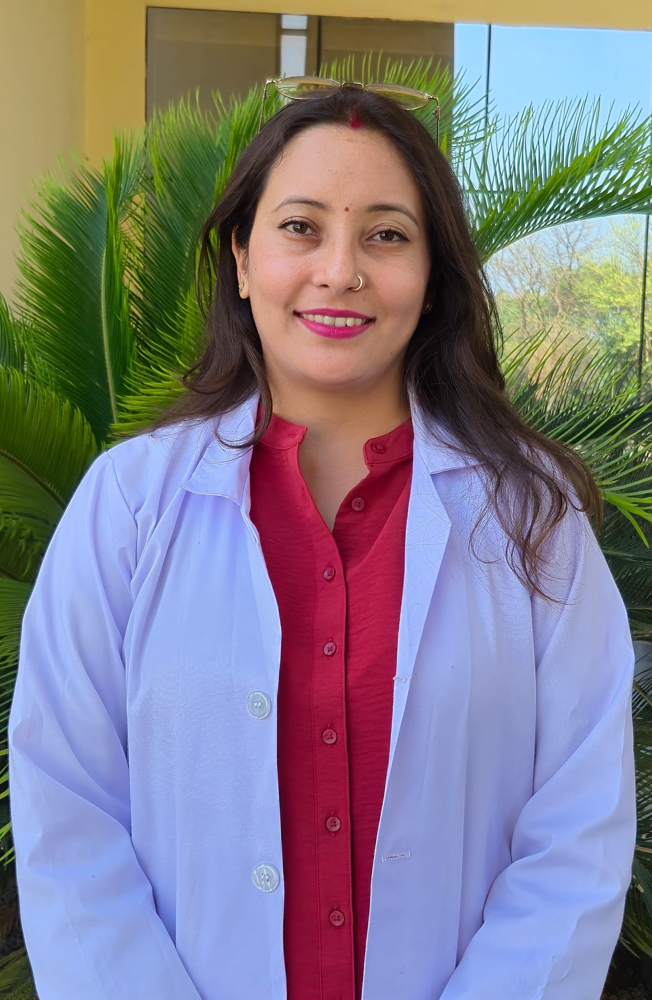
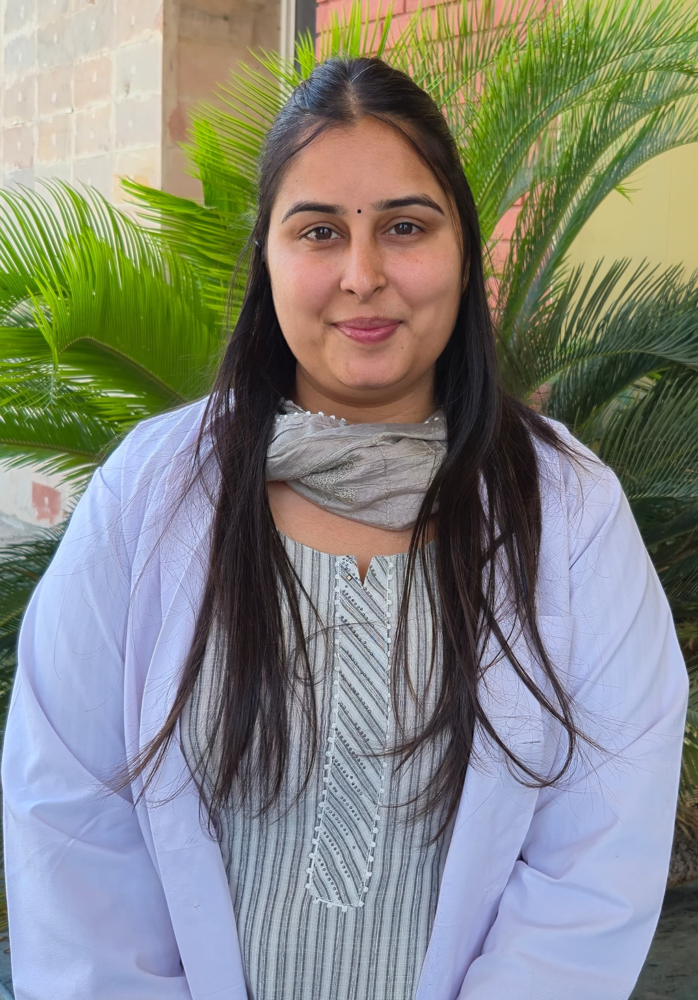
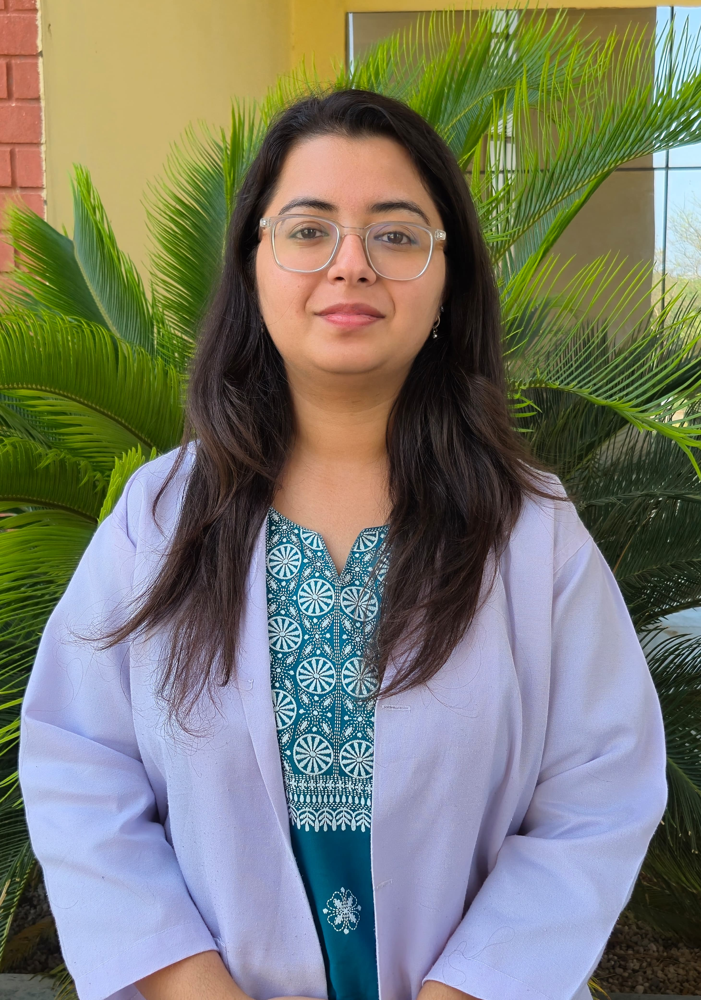

  
  

## About Our Lab

Our research lab leads cutting-edge investigations in microbial genomics, transcriptomics, fungal pathogenesis, and the human microbiome. We focus on clinically significant pathogens like *Candida* spp. and mucormycosis-causing fungi, integrating wet lab (*in vitro* and *in vivo*) experimentation—including antifungal screening and nanoparticle synthesis, with robust in-house multi-omics data analysis.

We explore antimicrobial resistance, host-pathogen interactions, and microbial pathogenesis using advanced tools in molecular biology and bioinformatics. The lab features a high-performance Linux-based genome analysis workstation running pipelines for genomics, transcriptomics, and metagenomics.

Our team brings expertise in large-scale omics data analysis and visualization, using R and Python to decode complex biological systems and their relevance to human health. This includes investigations into immune-mediated disorders such as Kawasaki disease, where integrative multi-omics profiling provides comprehensive insights into disease pathophysiology and host immune responses.

::: {.person-card .dr-khemraj style="text-align: left;"}

  <h3>Dr. Khem Raj</h3>
  
Dr. Khem Raj is an expert in microbial genomics, transcriptomics, and fungal pathogenesis. His research focuses on microbial-host interactions and antimicrobial resistance, combining experimental biology with integrative omics approaches. He specializes in data-driven insights using R and Python to explore complex host-pathogen dynamics. Under his leadership, the lab bridges molecular microbiology and computational biology to drive translational research on emerging pathogens.

:::

## Research Scholars

:::: {.columns style="margin-bottom: 2rem;"}
::: {.column width="50%"}

<h3>Preeti Negi</h3>

Research on green synthesis of silver nanoparticles using <em>Trillium govanianum</em> and their application in studying <em>Candida auris</em> pathogenesis. Combines principles of nanotechnology and computational docking to explore novel antifungal strategies.

:::
::: {.column width="50%"}

<h3>Gurkeerat Kaur</h3>

Conducted research on the antifungal and antibiofilm activities of green-synthesized silver-graphene nanohybrids against multidrug-resistant *Candida auris*, encompassing synthesis, characterization, and comprehensive biological evaluations.

:::
::::

:::: {.columns style="margin-bottom: 2rem;"}
::: {.column width="50%"}

<h3>Milani Sharma</h3>

Focuses on microbial community profiling and genomics to investigate the diversity, composition, and functional roles of microbiomes in host-microbe interactions.

:::
::: {.column width="50%"}

<h3>Kanika Multani</h3>

Genomic and transcriptomic analysis of mucormycosis using high-throughput sequencing and RNA-Seq workflows. Applies computational genomics to study fungal pathogens.

:::
::::

## M.Sc. Students

:::: {.columns style="margin-bottom: 0;"}

::: {.column width="50%"}

{width="110" height="140"}

### Anshika Thakur

Design and evaluation of antifungal peptides against *Candida tropicalis*, with emphasis on MIC determination, antifungal efficacy, and peptide–pathogen interactions.

:::

::: {.column width="50%"}

{width="110" height="140"}

### Ojal

Engaged in research on antifungal peptides against *Candida auris*, involving computational screening, peptide characterization, and analysis of antifungal activity to address multidrug resistance.

:::

::::

:::: {.columns style="margin-bottom: 0;"}

::: {.column width="50%"}

{width="110" height="140"}

### Pratibha Kaushik

Single-Cell Genomic and Transcriptomic Profiling of Pulmonary Mucormycosis: A Computational Analysis of Immune Dysregulation in BAL and Peripheral Blood.

:::

::: {.column width="50%"}

{width="110" height="140"}

### Aryan Bhan

Working on transcriptional changes in neutrophils during COVID-19 infection, with a strong focus on bulk RNA-Seq data analysis workflows and genomic workflows.

:::

::::

## Collaborators

  <h3>Dr. Manpreet Dhaliwal</h3>
  

    <strong>Advanced Paediatric Centre</strong> 
    Postgraduate Institute of Medical Education and Research
  

  <h3>Dr. Rakesh Kumar Pilania</h3>
  

    <strong>Department of Medical Microbiology</strong> 
    Postgraduate Institute of Medical Education and Research
  

## Research Projects

<h3>Ongoing Projects</h3>
<ol>
  <li>
    <strong>Whole Genome Sequencing of *Mycobacterium leprae* Clinical Strains for Determining Drug Resistance and Strain lineage in India: - A multicentre prospective study</strong> 
    <strong>Role:</strong> Co-Investigator 
    <strong>Funding Agency:</strong> ICMR  
    <strong>Funding Amount:</strong> INR 2.9 Crore
  </li>
  <li>
    <strong>To discover novel genetic variants predisposing to Inborn Errors of Immunity in pediatric and adult mucormycosis patients</strong> 
    <strong>Role:</strong> Co-Investigator 
    <strong>Funding Agency:</strong> Indian Council of Medical Research (ICMR), New Delhi 
    <strong>Funding Amount:</strong> INR 57.34 Lakhs
  </li>
</ol>

<h3>Completed Projects</h3>
<ol>
  <li>
    <strong>Deciphering the microbiome landscape of native and migrated 'Pangwala' tribal population of India</strong> 
    <strong>Role:</strong> Principal Investigator 
    <strong>Funding Agency:</strong> Department of Health Research, Govt. of India (File No. R.12020/13/2018-HR) 
    <strong>Funding Amount:</strong> INR 28.26 lakhs
  </li>
  <li>
    <strong>A transcriptome-based study to evaluate the pathways associated with immune dysfunction in COVID-19 Associated Mucormycosis</strong> 
    <strong>Role:</strong> Co-Investigator 
    <strong>Funding Agency:</strong> Pfizer, Fungal Infections Study Forum (FISF) 
    <strong>Funding Amount:</strong> INR 17 lakhs
  </li>
</ol>

## Publications

1. Dhaliwal, M., Muthu, V., Sharma, A., Raj, K., Rudramurthy, S. M., Agarwal, R., & Chakrabarti, A. (2024). Immune and metabolic perturbations in COVID‐19‐associated pulmonary mucormycosis: A transcriptome analysis of innate immune cells. <em>Mycoses</em>, 67(1), e13679. <a href="https://doi.org/10.1111/myc.13679" target="_blank">DOI</a>

2. Kaur, U. J., Chopra, A., Preet, S., Raj, K., Kondepudi, K. K., Gupta, V., & Rishi, P. (2021). Potential of 1-(1-napthylmethyl)-piperazine, an efflux pump inhibitor against cadmium-induced multidrug resistance in <em>Salmonella enterica</em> serovar Typhi as an adjunct to antibiotics. <em>Brazilian Journal of Microbiology</em>, 52(3), 1303-1313. <a href="https://doi.org/10.1007/s42770-021-00492-5" target="_blank">DOI</a>

3. Negi, P., Chadha, J., Harjai, K., Gondil, V. S., Kumari, S., & Raj, K. (2024). Antimicrobial and Antibiofilm Potential of Green-Synthesized Graphene–Silver Nanocomposite against Multidrug-Resistant Nosocomial Pathogens. <em>Biomedicines</em>, 12(5), 1104. <a href="https://doi.org/10.3390/biomedicines12051104" target="_blank">DOI</a>

4. Patial, S., Sharma, A., Raj, K., & Shukla, G. (2024). Atherosclerosis: Progression, risk factors, diagnosis, treatment, probiotics and synbiotics as a new prophylactic hope. <em>The Microbe</em>, 5, 100212. <a href="https://doi.org/10.1016/j.microb.2024.100212" target="_blank">DOI</a>

5. Raj, K., Paul, D., Rishi, P., Shukla, G., Dhotre, D., & YogeshSouche. (2024). Decoding the role of oxidative stress resistance and alternative carbon substrate assimilation in the mature biofilm growth mode of <em>Candida glabrata</em>. <em>BMC Microbiology</em>, 24(1), 128. <a href="https://doi.org/10.1186/s12866-024-03274-9" target="_blank">DOI</a>

6. Raj, K., Rishi, P., Shukla, G., Rudramurhty, S. M., Mongad, D. S., & Kaur, A. (2022). Possible Contribution of Alternative Transcript Isoforms in Mature Biofilm Growth Phase of <em>Candida glabrata</em>. <em>Indian Journal of Microbiology</em>, 62(4), 583-601. <a href="https://doi.org/10.1007/s12088-022-01036-7" target="_blank">DOI</a>

7. Rishi, P., Thakur, K., Vij, S., Rishi, L., Singh, A., Kaur, I. P., Patel, S. K. S., Lee, J. K., & Kalia, V. C. (2020). Diet, Gut Microbiota and COVID-19. <em>Indian Journal of Microbiology</em>, 60(4), 420-429. <a href="https://doi.org/10.1007/s12088-020-00908-0" target="_blank">DOI</a>

8. Riyaz, M., & Raj, K. (2023). Emerging Microbial Identification Technologies in the Era of OMICS and Genome Editing. In R. C. Sobti, R. C. Kuhad, R. Lal, & P. Rishi (Eds.), <em>Role of Microbes in Sustainable Development: Human Health and Diseases</em> (pp. 37-63). Springer Nature. <a href="https://doi.org/10.1007/978-981-99-3126-2_2" target="_blank">DOI</a>

9. Sarkar, S., Rastogi, M., Chaudhary, P., Kumar, R., Arora, P., Sagar, V., Sahni, I. S., Shethi, S., Thakur, K., Ailawadhi, S., Toor, D., & Chakraborti, A. (2017). Association of rheumatic fever & rheumatic heart disease with plausible early & late-stage disease markers. <em>Indian Journal of Medical Research</em>, 145(6), 758-766. <a href="https://doi.org/10.4103/ijmr.IJMR_1554_14" target="_blank">DOI</a>

10. Sharma, S., Raj, K., Riyaz, M., & Singh, D. D. (2023). Antimicrobial Studies on Garlic Lectin. <em>Probiotics & Antimicrobial Proteins</em>, 15(6), 1501-1512. <a href="https://doi.org/10.1007/s12602-022-10001-1" target="_blank">DOI</a>

11. Sihag, S., Kaur, G., Sharma, S., Dasgupta, A., Raj, K., & Kaur, R. (2025). Antimicrobial and Anticancer Potential of <em>Chitinophaga</em> sp. S167 Mediated Synthesis of Silver Nanoparticles. <em>ChemistrySelect</em>, 10(21), e00768. <a href="https://doi.org/10.1002/slct.202500768" target="_blank">DOI</a>

12. Verma, N., Riyaz, M., Kaur, G., Negi, P., Ghawri, H., & Raj, K. (2024). Anticandidal Efficacy of Green Synthesized Silver Nanoparticles Using Trans-Himalayan Plant Extracts Against Drug Resistant Clinical Isolates of <em>Candida auris</em>. <em>Indian Journal of Microbiology</em>, 64(4), 1912-1928. <a href="https://doi.org/10.1007/s12088-024-01277-8" target="_blank">DOI</a>

13. Vijeata, A., Ghawri, H., Chaudhary, G. R., Raj, K., & Chaudhary, S. (2025). Engineering fungicidal nitrogen-doped carbon dots from <em>Trillium govanianum</em> rhizomes: A theoretical and experimental approach against <em>Candida auris</em>. <em>Applied Surface Science</em>, 709, 163789. <a href="https://doi.org/10.1016/j.apsusc.2025.163789" target="_blank">DOI</a>

## News and Events

Travel award by ISHAM (International Society for Human and Animal Mycology) to present research work at ISMM, Chennai, 2025.

Our lab presented research at the 15th National Biennial Conference of the Indian Society of Medical Mycologists, showcasing advancements in fungal disease diagnostics and therapeutics.

Graduate students secured the 2nd and 3rd prizes at the International Conference on Harnessing the Power of Microbes for Viksit Bharat, recognizing their innovative contributions to microbial research.

Lab members also presented their latest findings at the Computational Biology Conference 2025, highlighting the integration of bioinformatics tools in infectious disease studies.

Our lab has been awarded an ICMR research grant to advance investigations into mucormycosis, strengthening our efforts in combating this life-threatening fungal infection.

## Join Us

Opportunities in microbiology, molecular biology and bioinformatics.

Email: khemrajthakur@gmail.com  

## Contact Us

Department of Microbiology  
Basic Medical Sciences Block I, South Campus  
Panjab University, Sector-25, Chandigarh-160014, India

Email: khemrajthakur@pu.ac.in  
Mobile: +91 9876726053  
[View on Google Maps](https://maps.google.com)
